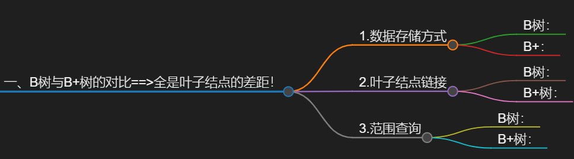

# 一、B树与B+树的对比==>全是叶子结点的差距！

 ## 1.数据存储方式

  ###  B树：
  每个节点储存键和**值和指针**

  ###  B+：
  树所有数据**均储存在叶子结点**，非叶子节点存储**键与指针**

---
 ## 2.叶子结点链接

  ###  B树：
  叶子节点之间**没有直接的链接**。

  ###  B+树：
  叶子节点通过**双向链表连接在一起**，形成一个有序的链表，**方便范围查询**。

---
 ## 3.范围查询

  ###  B树：
  需要在树中遍历节点，比较麻烦。

  ### B+树：
  由于叶子节点是**链表形式连接**，范围查询可以直接**通过链表遍历完成**，非常高效。