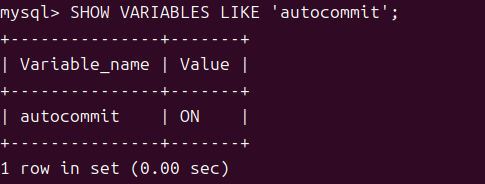
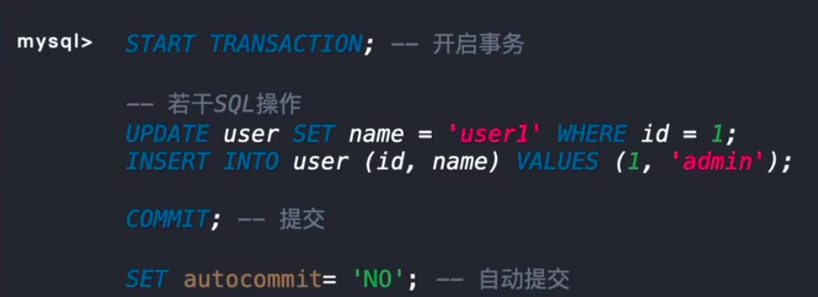

# 一、定义
指的是将多个数据库操作打包成一个**不可分割的整体**来执行，要么全部失败，要么全部成功！


# 二、引出ACID
为了完美的解决事务的一致且可靠的问题，`innodb提出了一套基于ACID模型的完整事务解决方案！`


这点很重要，因为其实我们很多时候就是不明白事务的基本概念而出错的！

----

# 二、事务开启与关闭
我们可以通过命令`start Transaction开启事务`，也可以通过`set autocommit="no"来设置动提交事务`

在 MySQL 中，**默认的事务行为是自动提交模式**，也就是**每条 SQL 语句都会被当作一个单独的事务来执行**，执行完毕后**自动提交**。可以通过以下命令查看自动提交状态：

### 也就是说，mysql里面事务需要自己开启，


```sql
SHOW VARIABLES LIKE 'autocommit';
```


