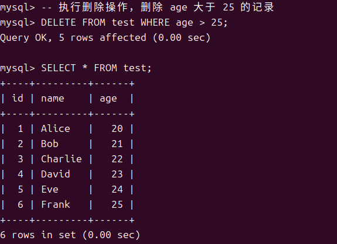
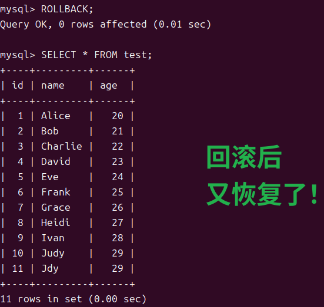
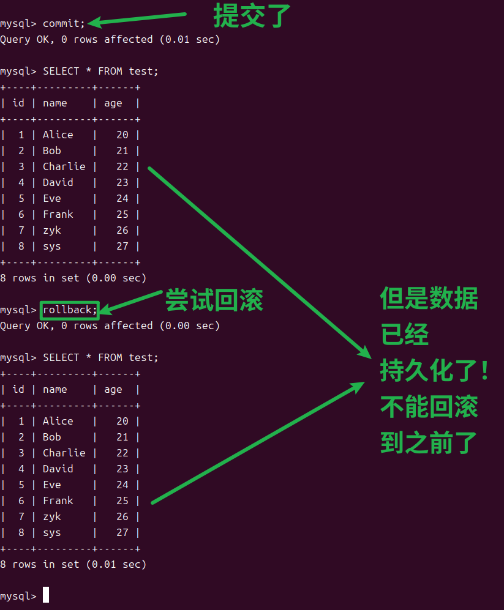

# 1.原子性实现方式
事务是`不可分割的整体`，要么全部执行成功，要么全部失败

innodb提供了**undo-log机制**(undo-log文件)，也就是在每一次改动数据时，会把相应的改动存储下来，对应一条日志，当一组操作某个异常时，就会触发回滚，使得这组操作已经执行的命令全部撤销，从效果上来开就像是没有执行过这一组命令一样！这就是执行的原子性！

# 2.实验演示
## 2.1背景：
首先明确，事务一旦提交，就不能回滚了，回滚就是为了事务提交过程中发生故障而生的！
目的是撤销只提交了一部分数据的情况，所以一旦提交成功，事物的生命周期就结束了！无法回滚！

## 2.2演示

### 2.3开启事务，未提交前的操作是可以回滚的！回滚至事务开始时的情况！

-- 关闭自动提交
SET autocommit = 0;

--查看原始数据

-- 执行删除操作，删除 age 大于 25 的记录

DELETE FROM test WHERE age > 25;

-- 查看删除后的数据

SELECT * FROM test;

-- 回滚事务
ROLLBACK;

-- 验证数据回滚结果
SELECT * FROM test;

-- 查看回滚后的数据

-- 恢复自动提交（可选，根据实际需求决定是否恢复）
SET autocommit = 1;

### 2.4开启事务，提交了就不能回滚了！

