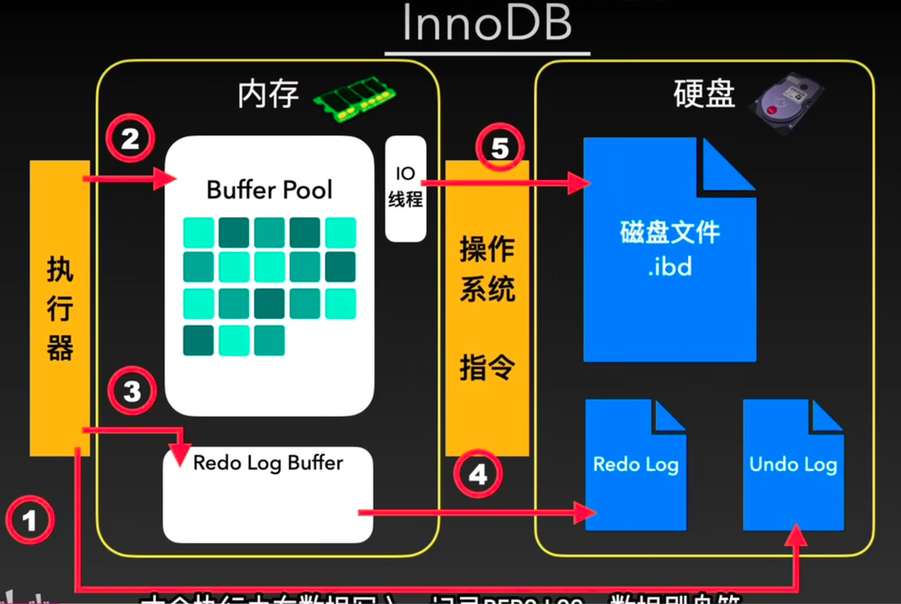
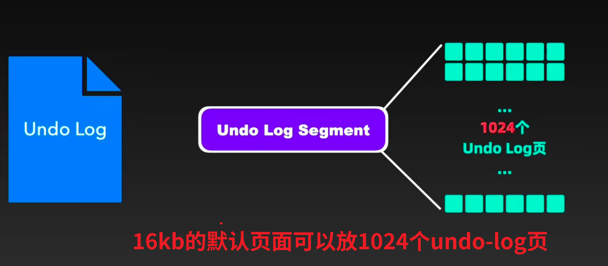
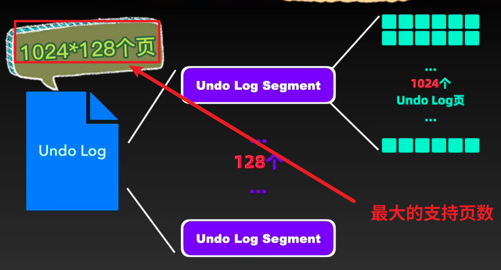
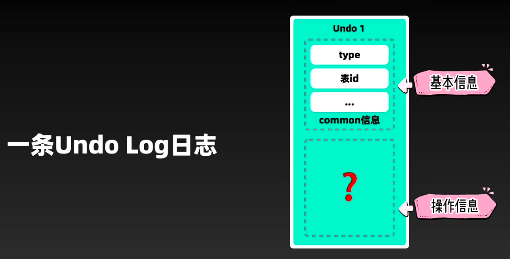
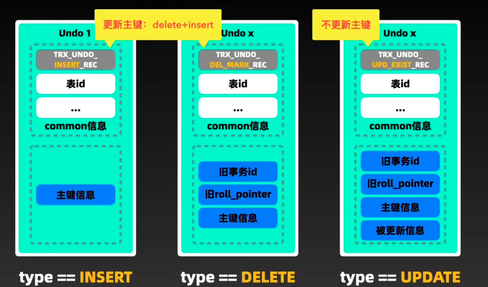
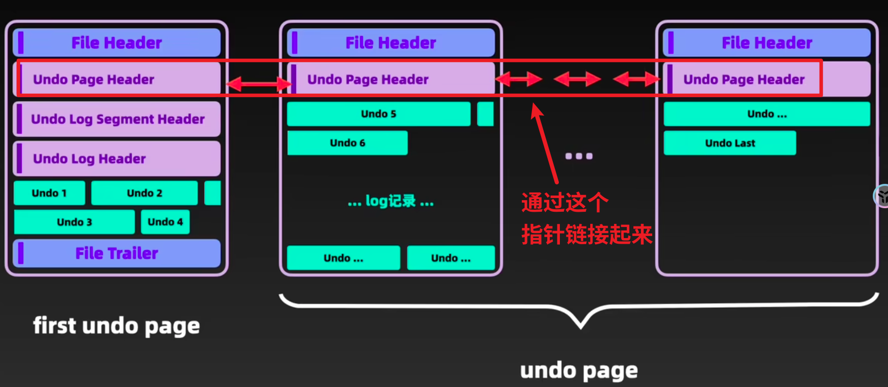
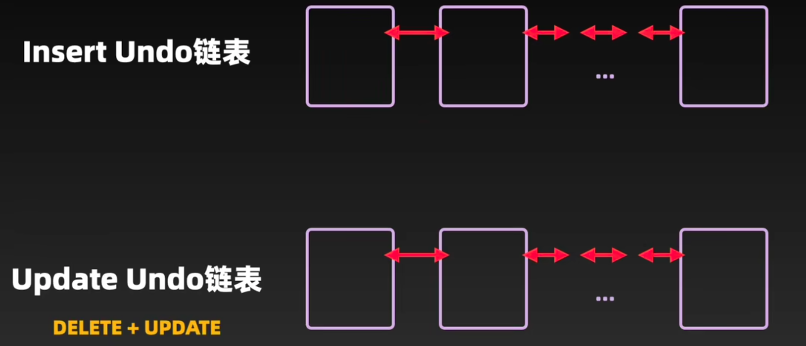
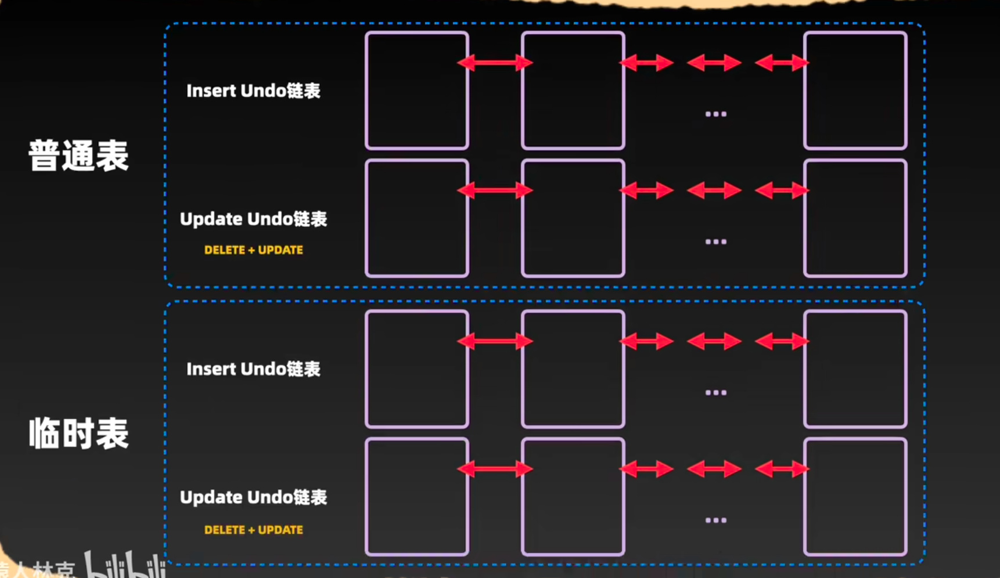

# 一、undo-log原子性
每个事务在进行数据操作的时候，都会在磁盘里面创建与之对应的undo-log，当事务异常时会根据undo-log进行逐一的撤销操作。保证了事务的原子性。

# 二、何时写入undo-log？
sql通过执行器就会写入undo-log

在事务中，每一条sql通过执行器之后，第一时间就会在回滚段undo-log segment中申请一个undo-log页，然后根据sql的信息构造对应的undo-log内容，然后将其写入磁盘，以保证每次操作真正数据之前，undo-log是完整的！

在undo-log执行后，才会执行内存数据写入，记录redo-log，数据刷盘等！


# 三、可以申请多大个undo-log？
undo-log不是无限申请的，对于16kb的默认页来说，每一个回滚段中可以申请1024个回滚页



我们可以通过设置回滚段的数量，默认是128个，所以最大的支持undo-log页数就是1028*128个



```sql
mysql> SHOW VARIABLES LIKE 'innodb_rollback_segments';
+--------------------------+-------+
| Variable_name            | Value |
+--------------------------+-------+
| innodb_rollback_segments | 128   |
+--------------------------+-------+
1 row in set (0.00 sec)

```

# 四、undo-log的格式



因为undo-log本质上是用来记录数据修改的，也就是新增、删除、更新的！
那么注定他就有3种格式——分别对应这三种数据的修改，每一种undo-log的信息都不一样

比如：

### 1.insert插入类型：

里面只有主键信息，因为这是一条完整的数据！

### 2. DELTE删除类型：

旧事务id

旧roll_pointer

主键信息

### 3.更新信息
旧roll_pointer

主键信息

主键信息

被更新信息




# 五、undo-log页面格式

## 1.undo-log首页面(first undo log)：


---
## 2.undo-log页面链条
当我们的undo-log过于多时，一个页面存不下，就会申请多个undo-log页面，然后每一个页通过undo-page-header链接至首个页


---
# 六、undo-log的分类
## 1.插入形式undo-log
事务提交后，可以直接删除。


## 2.更新、删除形式的undo-log
事务提交后，这两种类型的undo-log还需要服务于MVCC版本链。并不能直接删除。

## 总结：undo-log两条链
一条是只记录新增操作的 ，一类是记录更新和删除的

---
# 七、临时表

一个事物如果既有新增，又有修改，那么就会产生**临时表**！ 那么最终就会有4组undo链！

但是如果数据量非常大的话，undolog会有重用机制！


以上就是从事务角度来看undo-log的，下面将会介绍从数据角度来看！