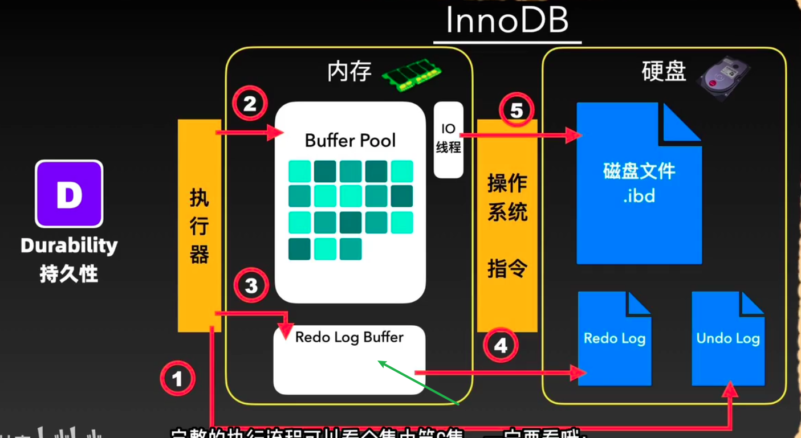

# 一、持久性定义
事务一旦提交，其更改是持久化的，不会因为电源故障，系统崩溃，竞争条件等意外情况而发生变化！

# 二、两种问题

## 1.在写入磁盘之前发生意外——redo-log

这样内存中的数据就会丢失，innodb是通过**redo-log机制**来完成，故障后内存中丢失数据会恢复到磁盘中！

## 2.刷盘时innodb页面和操作系统的页面不一致(16KB VS 4KB)
innodb刷盘页面是**16KB**，操作系统是**4KB**，所以在刷盘中发生意外时，数据页可能只刷新了一部分，没有被完整传输。
为了保证每一个磁盘中的数据页绝对完整，通过**建立双写缓冲区，通过其同步恢复机制来解决**
.png>)
