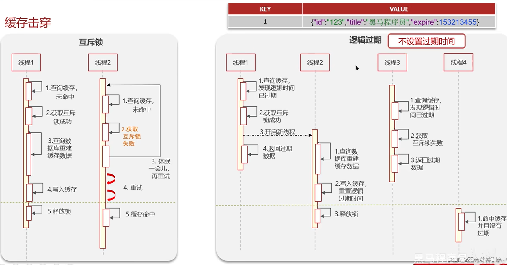

# 一、定义
Redis（Remote Dictionary Server）即远程字典服务，是一个基于内存的数据存储系统，是最流行的缓存中间件

# 二、Redis的三大模块
即 **缓存、分布式锁、高可用集群**

# 一、缓存

## 1.缓存穿透
### 定义：
查询一个数据库中不存在的数据(当然中间件中最初也一定不存在)，redis中也不存在，每次查询将发起数据库访问，磁盘IO导致数据库崩溃！
### 解决
### 本质：
1.我们需要去查DB中存不存在
2.redis中也不存在
针对1，我们可以直接在内存层完成数据是否存在的判断！
针对2，我们可以在数据库中查询后，将确定不存在的数据，返回null值到redis中，以便下次重复访问数据库！
### 方法1——布隆过滤器
本质上是一个二进制数组，通过将数据进行三次hash运算，再次模与数据长度得到三个下标，作为数据的唯一下标，每次查询时，先在内存区中查找(其实每次都会提前把预热数据放在redis中)，不存在就返回，存在就访问。

#### 优缺点：5%误判——哈希碰撞
优点：
内存级解决方案，不会造成磁盘访问
项目前解决方案，不一致问题发生性很小！

缺点：
因为是哈希，所以会有哈希误判，即多个数据映射到同一个下标，实际不存在的数据判断成存在的了，(布隆过滤器经典的一句话：不存在的一定不存在，存在的不一定存在就是来源于此)，那么如何解决？

#### 优化
笔者自己提出的解决方案：使用HashMap类似的解决方案，通过链表、红黑树解决哈希冲突。
具体做法：
## 新增哈希数组
因为哈希id一共有3个，所以最多涉及000-999个哈希位，新建一个数组，将数据是否存在的信息保存在其中，哈希碰撞了就直接用链表或红黑树解决，当然转换因子Factor可以自己设置。
## 是否需要排序
我们的得到的3个hashId需不需要排序？不需要，因为3的特殊性，如下，一个简单的判断就好了，性能应该会很快！
```java
A
AB BA
CAB ABC ACB
```
### 方法2——null隔离
将在数据库中查询不到的数据返回一个null值到Redis，下一次就不会再次重查
### 优缺点：
优点：简单
缺点：
1.内存消耗大
(比之前的布隆过滤器的优化大多了，因为这是针对不存在数据的，而前面的是存在的数据!如果来了100000个不存在的，前面的还是数据库中的内容，这里就要回设100000个数据!)
2.一定会导致一次磁盘IO，访问一次数据库，磁盘级别解决方案(**因为只有访问了才知道没有，才会回设**)
3.是运行时解决方案(只是在运行时才回设数据)，可能发生不一致问题


## 2.缓存击穿
### 2.1定义：
热点key在redis中过期时，大量请求发过来，导致DB崩溃。

解决：
## 1.互斥锁
## 本质——回设数据的安全保证
重建缓存数据，并使用redis的setnx命令完成互斥功能，确保我在会设数据过程中不会有线程访问DB，因为其他线程若来，直接在redis那里就休眠了。

## 优缺点
优点：1.高一致性
缺点：1.性能低一点，2.可能死锁

## 2.key的逻辑过期时间设置
## 本质——通过逻辑过期字段确保先用着，不来访问DB
对数据不设置过期时间，而是带一个逻辑过期字段，这就意味着永远也不会导致查不到数据(设置过期时间就会查不到)，访问时，发现逻辑时间过期了，那就先返回之前的数据，自己新开一个线程从DB中加载数据过来!

## 优缺点
优点：1.高性能
缺点：1.一致性低一点



## 3.缓存雪崩

