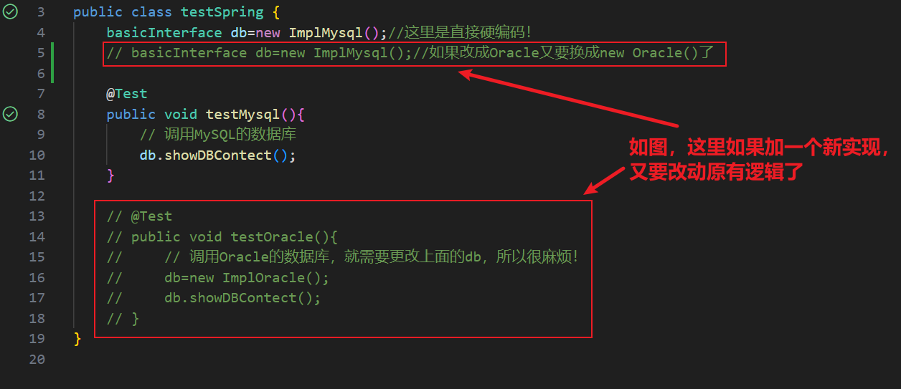

# 引出
基于以下痛点：
如果你有一个接口，假设是数据库连接接口，现在提供了MySQL、Oracle等等很多厂商的实现，那么每一次你与一个新的实现建立连接，是不是需要new一个该实现的对象？那如果有一万个实现呢？就很麻烦！


# 改进——IOC——字段只声明不创建!
## 定义：
IOC是控制反转的意思，含义为将需要程序员手动new对象的过程，改为由IOC这个容器来完成！
(完成创建、装配、管理等)，程序员直接从里面取出来用就好了！

## 简单代码示例理解控制反转
### 硬编码，每次换一个实现就改一次代码！
```java
package com.spring;
public interface basicInterface {
    void showDBContect();
}

public class ImplMysql implements basicInterface{
    @Override
    public void showDBContect(){
        System.out.println("this is MySQL~");
    }
}

public class ImplOracle implements basicInterface{
    @Override
    public void showDBContect(){
        System.out.println("this is oracle!");
    }
}

public class testSpring {
    basicInterface db=new ImplMysql();//最大的问题在这里，没换一个实现，就要改一次
    @Test   
    public void testMysql(){
        // 调用MySQL的数据库
        db.showDBContect();
    }

    // 
    // @Test   
    // public void testOracle(){
    //     // 调用Oracle的数据库，就需要更改上面的db，所以很麻烦！
    //     db.showDBContect();
    // }
}

```

### 软编码，将对象字段的初始化延迟到setter里面
```java
package com.spring;
public interface basicInterface {
    void showDBContect();
}

public class DBImpl implements basicInterface {
    private basicInterface DBInterface;//最大的区别在这，这里只声明不创建，实例由后面的setter创建(就这一步！)
    // 利用set实现
    public void setDB(basicInterface DBInterface){
        this.DBInterface=DBInterface;
    }
    @Override
    public void showDBContect(){
        this.DBInterface.showDBContect();
    }
}

public class testSetter {
    private DBImpl db =new DBImpl();
    // 最大的区别就是将创建对象的工作封装了起来，成为了一个接口！
    // 这样我们创建对象就是在接口里面完成的了，不再是由程序员直接创建了!
    @Test
    public void test(){
        db.setDB(new ImplMysql());
        db.showDBContect();
        db.setDB(new ImplOracle());
        db.showDBContect();
    }
}

```


## IOC的两大步
## 1.创建对象并放入容器之中
### 1.基于注解


### 2.基于XML(放弃，过时了)

## 2.管理对象

