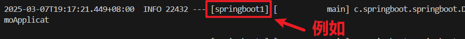

# 综述：
在 Spring Boot 项目里，resources 文件夹下的 application.properties 文件属于**配置文件**，其用途是对 Spring Boot **应用程序的各种属性进行配置**。

----
## 一、spring.application.name=springboot1

## 综述：
spring.application.name=springboot1 这一配置项**为应用程序提供了一个唯一的标识**，在日志记录、服务注册、配置管理、监控和自定义代码等方面都有着重要的作用。


在这行配置中，spring.application.name 是一个 **Spring Boot 内置的属性**，其作用是**指定应用程序的名称**，而 springboot1 则是你赋予该应用程序的具体名称。

---
### 1.日志记录：

在日志输出时，Spring Boot 会把应用程序的名称包含进去，这样有助于**在日志文件里对不同应用程序的日志进行区分**。例如，当你查看日志时，能够清晰地知道**某条日志是由哪个应用程序产生的**。示例日志输出可能如下：



----
### 2. Spring Cloud 相关组件
在 Spring Cloud 生态系统中，应用程序的名称是一个**非常关键的标识**。以下是几个常见的使用场景：

#### 2.1服务注册与发现：

当使用 Eureka、Consul 或 Nacos 等服务注册中心时，应用程序会将**自身的名称注册到注册中心**。其他服务可以**通过该名称来发现并调用这个服务**。例如，在 Eureka Dashboard 中，你会看到 springboot1 作为服务名显示在服务列表里。


#### 2.2配置管理：

在使用 Spring Cloud Config 进行配置管理时，应用程序会根据自身的名称**从配置服务器获取对应的配置信息**。例如，springboot1 应用程序会从配置服务器获取名为 springboot1.properties 或 springboot1.yml 的配置文件。

---
### 3.自定义代码：

在你的自定义代码中，也可以**通过 Environment 对象来获取应用程序的名称**。示例代码如下：
```java
import org.springframework.beans.factory.annotation.Autowired;
import org.springframework.core.env.Environment;
import org.springframework.stereotype.Component;

@Component
public class ApplicationNamePrinter {

    @Autowired
    private Environment environment;

    public void printApplicationName() {
        String applicationName = environment.getProperty("spring.application.name");
        System.out.println("Application name: " + applicationName);
    }
}
```