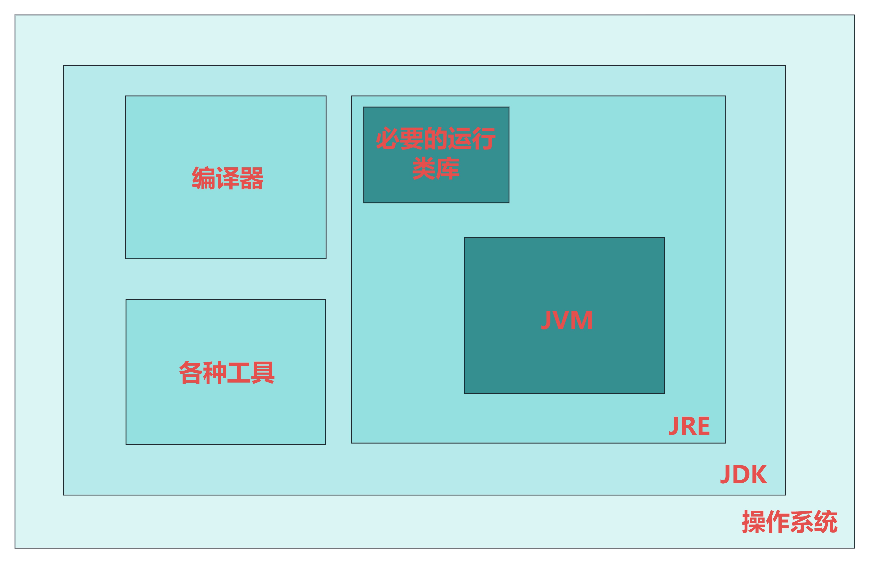

# 一、java 程序运行的全过程

## 1.javac编译成字节码：
当我们使用 javac 编译器对 Hello.java 文件进行编译时，javac 会对源代码进行词法分析、语法分析、语义检查等一系列操作，将其转换为符合 Java 虚拟机规范的字节码，并存储在 Hello.class 文件中。 
## 2.java启动jvm，装载字节码
当我们运行这个 Java 程序时，通过执行 java 命令启动 Java 虚拟机（JVM）。JVM 首先会进行一些初始化工作，包括加载必要的系统类库等。 然后，JVM 读取 Hello.class 文件，将其中的字节码加载到内存中。

## 3.CPU执行字节码
JVM 中的解释器会逐行解释执行这些字节码指令。 在执行过程中，字节码指令可能会涉及到各种运算、内存操作、方法调用等。当遇到一些频繁执行的代码片段时，JVM 可能会通过即时编译器（JIT）将这些字节码进一步编译成本地机器码，以提高执行效率。 

## 4.操作系统与JVM动态交互
这些运算和操作最终会转化为对 CPU 的指令请求。CPU 会根据这些指令进行计算、数据处理等操作，并将结果反馈给 JVM。JVM 再根据程序的逻辑进行后续的处理和输出。 整个过程是一个复杂而有序的交互过程，通过 JVM 作为中间桥梁，将 Java 程序的逻辑转化为 CPU 能够理解和执行的指令，从而实现程序的功能。

# 二、JVM
# 一图解前言

JVM作为应用层

JVM作为硬件层

## 定义
## 下接OS，上承字节码的虚拟计算机
可见，JVM就是一个中间指令的翻译器，下接OS，上承字节码，(也可以将JVM看成是一台虚拟计算机，宿主机的OS被抽象成硬件，字节码就是计算机中的指令)

# 三、虚拟机分类

## 系统虚拟机
  VMware
  完全对物理机的仿真，提供了一个完完全全的可运行真实操作系统的软件平台
## 程序虚拟机
  JVM
  他为专门执行**单个计算机程序**而设计，在JVM中执行的执行称为JAVA字节码指令

---
# 四、JVM指令集架构
## 物理机
 基于寄存器
  X64·
   使用**寄存器**存储指令执行的**现场信息**
   优点
    性能优秀和执行更高效。

## JVM
 基于栈
   使用栈存储指令执行的现场信息
   优点
    不需要硬件支持，可移植性更好，可以更好地实现跨平台。

---
# 五、JVM生命周期
## 启动
  java命令启动
## 运行
  找到main()运行java程序
## 结束 
  最后一个**非守护线程(GC等后台线程)**终止后JVM进程就结束

---
# 六、三层架构
## 最上层——类装载器子系统。
   javac编译器将编译好的字节码文件，通过Java类装载器执行机制，把字节码文件存放在JVM 内存划分区域。

## 中级层——运行时数据区。
   主要是在Java 代码运行时用于**存放数据的区域**，包括方法区、堆、Java 栈、程序计数器、本地方法栈。

## 最下层——执行引擎层。
   执行引擎包含**解释器**、**JIT编译器**和**垃圾回收器**。

