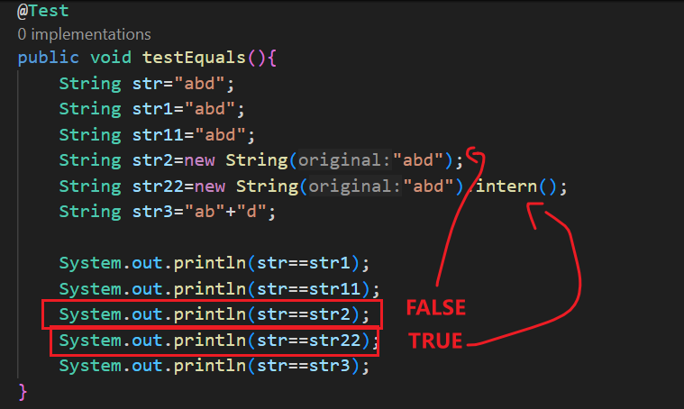
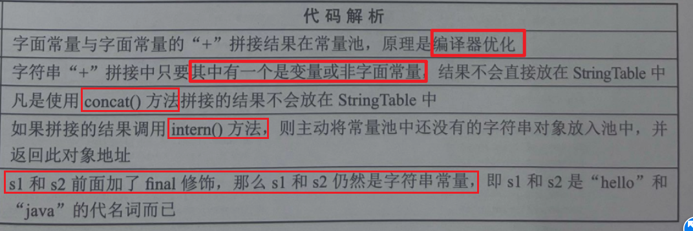

## 位置：
字符串常量池JAVA7以前是运行时常量池的一部分，JAVA7之后，放在了堆中！

# 一、写在前面、JVM的常量池共享
 **字符串的分配和其他的对象分配一样**，耗费高昂的时间与空间代价。JVM为了提高性能和减少内存开销，在**实例化字符串常量的时候进行了一些优化**，使用字符串常量池实现对字符串常量对象的共享以节省大量的内存空间。
 
# 二、、String字符串特性

## (一)不变性
  String是不可变的字符序列，即字符串对象具有不可变性。(和Integer一样)例如，对字符串变量重新赋值、对现有的字符串进行连接操作、调用 String的replace 等方法修改字符串等操作时，都是**指向另一个字符串对象**而已，对于原来的字符串的值不做任何改变。
  正因为不变，所以可以共享

## (二)共享性
  
  常量池中的对象共享
   Java把需要共享的字符串常量对象存储在字符串常量池(**StringTable**)中，即**字符串常量池中是不会存储相同内容的字符串的**。
## (三)不可继承
  String类声明是加final修饰符的，表示String类不可被继承；

## (四)可序列化
  String类实现了Serializable接口，表示字符串对象支持序列化；

## (五)可比较
  String类实现了**Comparable**接口，表示字符串对象可以比较大小。


# 三、创建字符串
 
## (一)字面量创建
  String s1=“atguigu”；

## (二)new创建
  String s2=new String(“hello”)；

## (三)高效创建字符串
  StringBuffer()
   当出现大量字符串拼接时，使用字符串缓冲区StringBuilder或StringBufer 将提高字符串拼接效率。

## (四)intern()——强行将字符串放进常量池中！

   当应用程序需要**存储大量相同字符串的时候**，调用**intern()方法**，可以大大降低内存消耗。
   因为回去寻找池子里面的相同的字符串，如果有**就直接返回该字符串的地址共享之，不必创建**,没有再将自己放进去，并且创建！

### 例子


我们平时的**String str2=new String("abd");**都是**重新创建对象**的，但是使用字面量就会去字符串常量池里面共享！
还有，在堆中的对象，可以使用Intern()方法强行放进字符串常量池里面，**并返回里面的引用**，不会在创建！

```java
@Test
    public void testEquals(){
        String str="abd";
        String str1="abd";
        String str11="abd";
        String str2=new String("abd");
        String str22=new String("abd").intern();
        String str3="ab"+"d";
        
        System.out.println(str==str1);
        System.out.println(str==str11);
        System.out.println(str==str2);
        System.out.println(str==str22);
        System.out.println(str==str3);
    }
```


# 四、字符串常量池StringTable
 
## (一)本质
  StringTable是一个固定大小的 HashTable

## (二)哈希冲突
  如果放进 StringTable 的 String 非常多，就会造成hash冲突严重，从而导致链表很长，链表过长会造成当调用 String.intern（） 方法时性能大幅下降。

## (三) 放置条件

### 1.字面量创建时直接放入
   Sting类型的常量池使用比较特殊，当直接使用字面量的方式(也就是直接使用双引号)创建字符串对象时，会直接将字符串存储至常量池。

### 2.其他方式创建
   当使用其他方式(如以new的方式)创建字符串对象时，字符串**不会直接存储至常量池**，而是**在堆中**但是可以**通过调用 Sting 的intern()法将字符串存储至常量池**。


# 五、放在池中还是堆中？



# 六、运行时常量池、字符串常量池的位置

## 运行时常量池
一直放在方法区(JDK8前叫永久代，JDK8后叫元空间)

## 字符串常量池的位置
JAVA 7以前，是运行时常量池的一部分，放在永久代

JAVA 7以后，单独剖离运行时常量池，放在了堆中 ！
