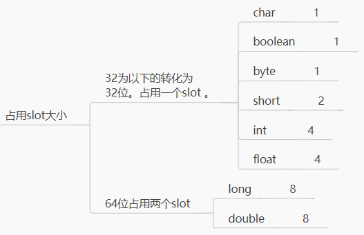

# 一、局部变量表
编译期确定大小！
## 1.本质：数字数组
## 2.作用：储存方法参数+方法体内的局部变量
基本类型——存储值

引用变量——存储引用的地址

## 3.基本单元：slot(槽)，数字数组的下标。
### (1)索引访问
  JVM 会为局部变量表中的每一个slot都分配一个访问索引，通过这个索引即可成功访问到局部变量表中指定的`局部变量值`。

### (2)占用slot大小

