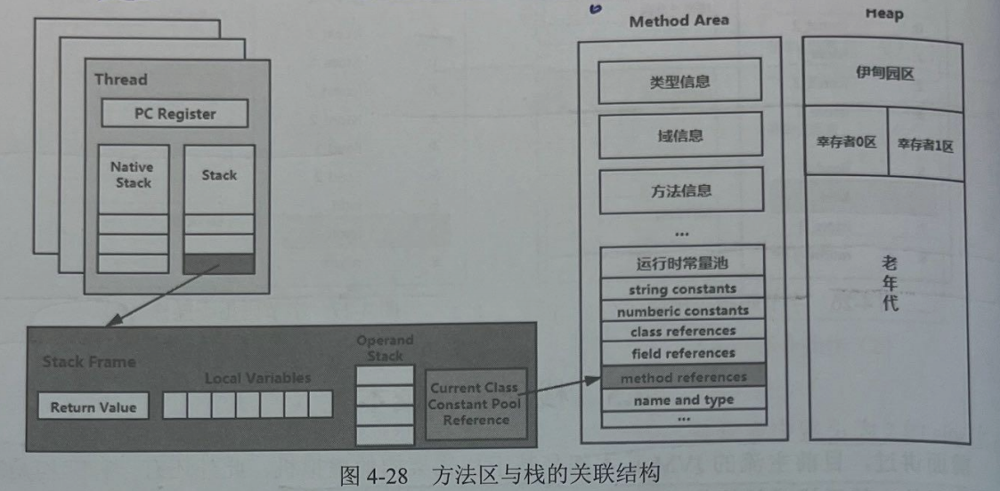

# 三、动态链接
## (一)本质
 每一个栈帧内部都包含一个**指向运行时常量池中该栈帧所属方法的引用**，这块**内存就是动态链接**。包含这个引用的目的就是为了支持**当前方法的代码能够实现动态链接**。

## (二)绑定机制

### 1.定义
  前面说了动态链接的作用就是将`符号引用转换为调用方法的直接引用`（符号逻辑转化为真实的地址数据）。在JVM中，将符号引用转换为调用方法的直接引用与`方法的绑定机制`相关，方法的绑定机制有两种，分别是态链接和动态链接。

### 2.分类
## (1)静态链接
   当一个字节码文件被装载进JVM内部时，如果被调用的目标方法**在编译期可知**，且**运行期保持不变**时。这种情况下，将调用方法的符号引用转换为直接引用的过程称为静态链接。
## (2)动态链接
   如果被调用的方法在编译期无法被确定下来，也就是说，只能够在**程序运行期**将调用方法的符号引用转换为直接引用，由于这种引用转换过程**具备动态性**，因此也就被称为动态链接。

----
## (三)作用：
### 1.常量池
 在 Java 源文件被编译成字节码文件时，`所有的变量和方法引用都作为符号引用保存在 class 文件的常量池里`。
 
### 2.符号引用转化为直接引用
 描述`一个方法调用了另外的其他方法时`，就是通过`常量池中指向方法的符号引用`来表示的。动态链接的目的就是在`JVM加载了字节码文件`，将`类数据加载到内存以后，当前栈帧能够清楚记录此方法的来源`。将字节码文件中记录的符号引用转换为调用方法的直接引用，直接引用就是**程序运行时方法在内存中的具体地址**(具体位置在运行之前无法确定下来!)。

### 3.直接引用与符号引用
### 符号引用
  符号引用是在**编译阶段生成的一种间接引用**，用于描述程序中的类、方法、字段等。这些符号引用在 .class 文件中以`字符串形式存在`，例如类名、方法名、字段名等**(存在于方法区中!)**。
### 直接引用
  在字节码中，符号引用不会直接包含所引用的目标内存地址，而是以符号的形式表示。当 JVM 解析这些符号引用时，会在**类加载和链接的过程中将它们解析成实际的内存地址或其他直接引用**。
