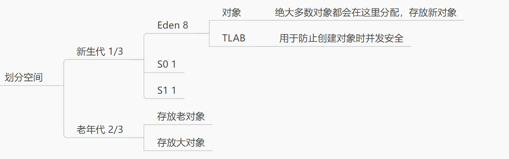

# 一、定义
java里面存放对象的地方

# 二、各种关联
## 与栈：
堆中存放的是对象，栈帧中保存的是对象引用，这个引用指向对象在堆中的位置
## 与方法区：
堆中的对象的对象头上的`类元数据指向的就是方法区中的类信息`，如字段、方法（模版信息！）

# 三、堆的内存划分详解：
## 1.动机
 有利于GC，优化GC效率
 注意方法结束后，对象可能不会立马回收，`要等待GC`
  `特例：栈上分配`

## 2.划分空间

## 3.堆中分配策略
 (1)优先分配到 Eden 区。
 (2)大对象直接分配到老年代，在开发过程中应尽量避免程序中`出现过多的大对象`
 (3)长期存活的对象分配到老年代。
 (4)通过动态对象年龄判断，如果Survivor区中相同年龄的所有对象的大小总和`大于 Survivor区的一半`，年龄大于或等于该年龄的对象可以直接进入老年代，无须等MaxTenuringThreshold 中要求的年龄。

# 四、对象创建~回收实例
## 什么时候回收？
总之，内存不足就会触发GC

对象从创建到消亡的8大步垃圾回收的历程
 对象先放在Eden区
 当Eden区间空间不足时，触发垃圾回收
 Eden区的剩余对象移动到S0区（清空Eden区）
 如果再次触发垃圾回收，对Eden区和S0区进行垃圾回收，没有被回收的对象就会移动到 S1区，S0区移动过来的对象的年龄计数器变为2，Eden 区转移过来的对象的年龄计数器为 1。
 如果再次经历垃圾回收，此时没有被回收的对象会重新放回S0区,接着再去S1区,对象在 S0 区和 S1 区之间每移动一次，年龄计数器都会加1.
 什么时候能去老年代呢?默认是15，超过15的对象进入老年代
 在老年代，内存相对充足。当老年代内存不足时，再次触发GC，此时可能发生 MaiorGC 或者 Full GC，进行老年代的内存清理
 若老年代执行了Major GC之后发现依然无法进行对象的保存，就会产生OOM异常。S0 区、S1 区之所以也被称为From 区和 To区，是因为对象总是从某个Survivor(From)区转移至另一个 Survivor(To)区，如此往复循环。

 # 五、垃圾回收器的视角
 

# 六、TLB——线程私有，分配首选！
全名：Thread Local Allocation Buffer，`线程本地分配缓冲区`
## 背景：

(1)堆区是线程共享区域，任何线程都可以访问到堆区中的共享数据。

(2)由于对象实例的创建在`JVM中非常频繁`，因此在**并发环境下从堆区中划分内存空间是线程不安全的**。

## 定义
 堆中`唯一的线程私有的区域`，称为**线程本地分配缓存区**
 TLAB 表示JVM 为`每个线程分配了一个私有缓存区域`，这块缓存区域包含在 `Eden 区内`。简单说 TLAB 就是在堆内存中的 Eden 区分配了一块线程私有的内存区域。

## 作用
 提高内存分配效率
 提高并发性能

## 地位
 JVM将此区域作为对象分配的首选

# 七、逃逸分析——JIT优化

## 1.一句话；对象作为局部变量，就不会逃逸，优化成栈存储

## 2.逃逸分析定义
 一个对象并**没有逃逸出方法**，那么就可能**被优化成栈上分配**。这样就**无须在堆上分配内存**，也**无须进行垃圾回收了**。这也是最常见的**堆外存储技术**。

## 3.常见类型

### (1)栈上分配
 #### 定义
  一个对象并没有逃逸出方法，那么就可能被优化成栈上分配。
 #### 好处
  节约内存
  避免GC
  提升性能
   (相对性，如果对象都逃逸了，开启这个算法的成本大于优化的成本就得不偿失了)

### (2)同步省略
 #### 定义
  如果一个对象被发现只能从一个线程被访问到，那么对于这个对象的操作可以不考虑同步，即使被同步块锁定
### (3)标量替换
 #### 标量
  基本类型
 #### 聚合量
  可以将拆解的，比如对象
 定义
  JIT编译器的编译阶段，如果经过逃逸分析，发现`一个对象不会被外界访问的话`，那么`经过JIT优化,就会把这个对象拆解成若干个成员变量`。这个过程就是**标量替换**。