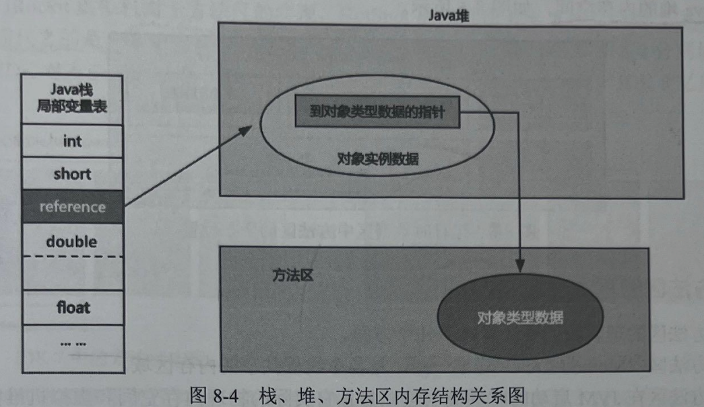

# 一、作用：——存放类元数据的地方
存放不变量的内存区域
1.类模版信息
2.JIT及时优化代码

# 二、方法区、堆、栈的交互

## 一、经典的Student student=new Student()问题
.png>)

JVM启动之时将`字节码里面的类信息、常量信息加载进方法区之中`，通过new 关键字利用方法区中的这些信息**在堆中创建了一个实例对象**，该对象的**对象头上的元数据指针指向方法区中的类信息**。并将**该对象的引用传递至虚拟机栈的局部变量表上**，用**student标记**。

## 二、三者交互图解！

所以这三者的关系用一句话来说就是：
虚拟机栈上的（准确的说是栈帧上的局部变量表中的）对象引用指向堆中的对象实例，堆中的对象实例指向方法区中的类信息。这三者接力。