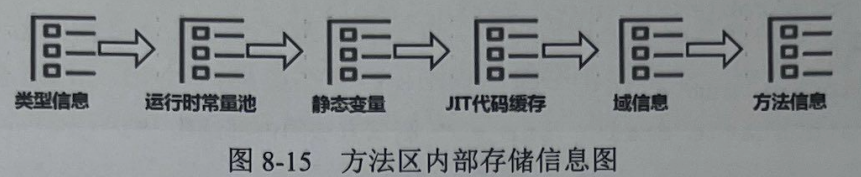
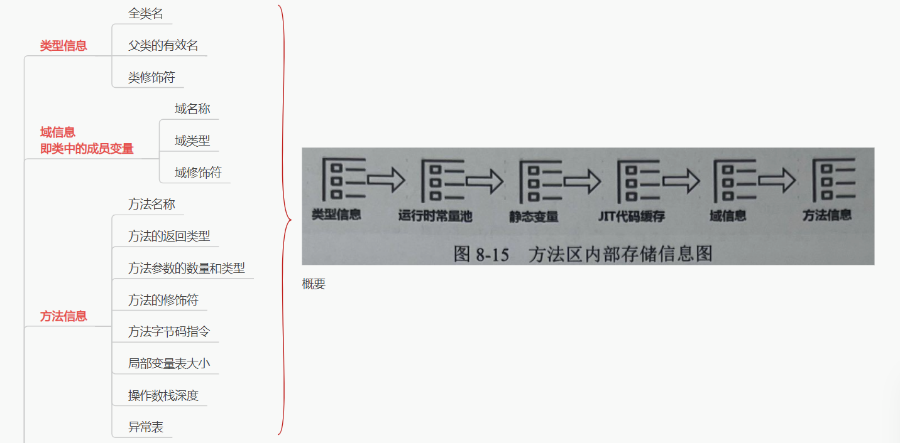

# 一、方法区的组成

## 一、类型信息
 全类名
 父类的有效名
 类修饰符

 
## 二、域信息即类中的成员变量
 域名称
 域类型
 域修饰符

## 三、方法信息
 方法名称
 方法的返回类型
 方法参数的数量和类型
 方法的修饰符
 方法字节码指令
 局部变量表大小
 操作数栈深度
 异常表

# 二、方法区具体的实现——元空间、永久代
补一嘴：

JDK8前**类变量与常量都是存在方法区（实现为永久代）**中，

JDK8级之后，**只有常量还存在方法区**中（**实现为元空间**），**类变量放在了堆中**。这里也体现了前面所说的哲学分层原理
（因为类变量会变）。