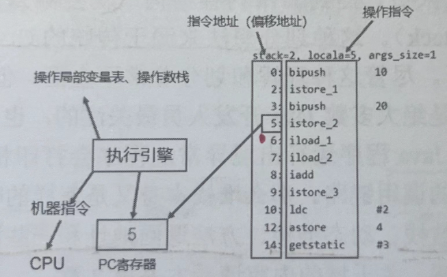

# 一、抽象
 就是对物理寄存器PC的逻辑抽象(再次印证了JVM就是一台抽象计算机!)

# 二、本质：一块极小的内存区域
 
# 三、作用：用于存储执行字节码地址

# 四、流程举例
 指令地址的5可以理解为**程序计数器器所存储的数据**。执行引擎会在**程序计数器存储5的位置**读取相应的操作指令，接下来执行引擎会操作 JVM 的局部变量表、操作数栈进行存、取、加、减等运算操作，还需要将字节码指令翻译成相应的机器指令，再让对应的CPU 进行运算。
 
 
# 五、常见问题

  为什么使用程序计数器记录当前线程的执行地址?
  因为 CPU需要不停地切换各个线程，切换回来以后，就需要知道接着从哪里开始继续执行。JVM 的字节码解释器通过改变程序计数器的值，来明确下一条应该执行什么样的字节码指令。

# 六、程序计数器为什么会被设定为线程私有?
  
  为了在高并发情况下，每一个线程在使用完自己的CPU时间片之后，**CPU会执行下一个线程**。**CPU需要准确地读取到下一线程的地址。线程众多，那最好的方式就是将每个线程都配上PC**. 独立计算，互不干扰。

