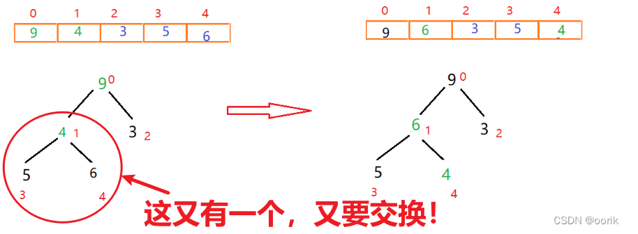

# 一、定义
堆是完全二叉树的子集，因为父节点和左右子节点的大小关系而独立定义
# 二、分类
## 大顶堆：每个节点的值都大于等于他的左右子节点的值


## 小顶堆：每个节点的值都小于等于他的左右子节点的值


# 三、排序思想
## 核心：堆最上面的一个元素是最值，递归遍历即可！

1.首先将待排序的数组构造成一个大根堆，此时，整个数组的最大值就是堆结构的顶端
2.将顶端的数与末尾的数交换，此时，未尾的数为最大值，剩余待排序数组个数为n-1
3.将剩余的n-1个数再构造成大根堆，再将顶端数与n-1位置的数交换，如此反复执行，便能得到有序数组
(反正确保的就是父节点大于子节点嘛，**就这一个特性，就可以得到最值，这样一直遍历即可**！)

## 注意:
升序用大根堆，降序就用小根堆(默认为升序)

还是上面的大顶堆，按照层序遍历转化为数组：


# 四、构造堆：


## 核心点——最后一个叶子结点索引=len/2,最后一个非叶子节点索引=len/2-1


这是因为完全二叉树的每一层都是上面一层的两倍，特有的性质！
那如何利用这个规律构建大顶堆呢? =>
## 答案是一直交换非叶子节点的最值！
我们找到了最后一个非叶子节点，即元素值为6的节点，比较**它的左右节点中最大的一个的值**，是否比他大，如果大就交换位置。
这样就保证了父节点一定较左右节点大！

## 流程
以下是交换流程：





## 总结
如此我们便构造出来了堆，总结来说，就是一句话：
## 从下而上，自上而下分别共构造两次完成构造！

---
# 五、排序:
一句话：不断将顶点和当前未排序末尾的值互换位置，剩余元素重构大顶堆(注意剩余很重要，有序的都不能在动了)！
这样每一次交换，最值都在后面，就是一个升序数组了！

## 流程


## 细节：父子之间的索引转化
父->子:n->2n+1,2n+2
子->父:n->(n-1)/2
最后一个叶子结点索引：len/2
最后一个非叶子结点索引：len/2-1


# 六、代码实现——就是三个循环
堆排序
```java
public class HeapSort {
    // 自上往下构建0~截止位置
    public void heapAdjust(int[] arr, int start, int end) {
        for (int i = start * 2 + 1; i < end; i = 2 * i + 1) {//这里比较左节点的同时也把右节点比较了的！

            if (i < end-1 && arr[i] < arr[i + 1]) {// 比较左右节点的较大值
                i++;
            }
            if (arr[start] < arr[i]) {// 父节点与左右节点较大值交换
                swap(arr, start, i);
                start = i;
            } else {
                break;
            }
        }
    }

    void heapSort(int arr[], int length) {// 传入的是索引
        //自下往上， 第一次构建大根堆(最后一个飞叶子节点)
        for (int i = length / 2 - 1; i >= 0; i--) {
            heapAdjust(arr, i, length);
        }
        // 每次进行首尾交换，再次构建堆
        for (int i = 0; i <= length; i++) {
            swap(arr, 0, length - i);
            heapAdjust(arr, 0, length - i - 1);// 进行调整，每次都少构建一个索引
        }
    }

    public void swap(int[] arr, int i, int j) {
        int temp = arr[i];
        arr[i] = arr[j];
        arr[j] = temp;
    }
}
```
# 测试代码
```java
public class Main {
    public static void main(String[] args) {
        HeapSort heapSort = new HeapSort();
        int arr[]={2,4,5,1,6};
        heapSort.heapSort(arr, arr.length-1);
        for (int i : arr) {
            System.out.println(i+" ");
        }
    }
}

```