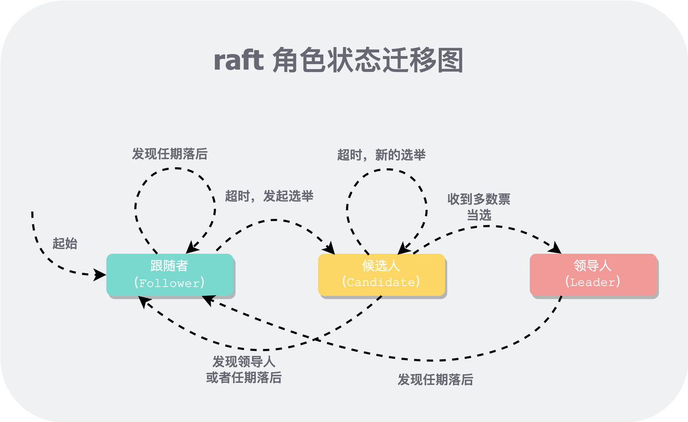

# 一句话:从节点向主节点收敛！
## 一、角色转换
### 0.如何转化为主节点？
### 1.三种状态
Follower 从节点
Candidate 候选节点
Leader 主节点



4个最基本的转换
```C
F->C:超时，发起选举
C->L:收到多数票当选
L->F:任期落后
C->F:发现L或者任期落后
```

### 2.角色转换的巧记
所有的角色都遵循：
```C
0.触发条件？
1.能不能成？
2.能了干什么？
```
#### F:
##### 触发条件
```C
1.初始
2.F->F(来自L的压迫、宕机)
3.C->F(发现更高任期/L、宕机)
4.L->F(发现更高任期、宕机)
```
##### 能不能成？
```C
Follower节点没有能不能成，一定成，只是触发条件！
```
##### 成了干什么？
一句话：向主节点收敛(三大件)
```C
1.三大件：
1.1 任期向主节点靠齐
1.2 重置投票

2.持久化：
如果任期改变的话，需要持久化！
```


---
#### C:
##### 触发条件？
```C
F 选举超时
```
##### 能不能成？
选举超时了一定成为Candidate，只不过在能不能成L的问题！
##### 成了干什么？
一句话：向主节点收敛(三大件)
```C
1.三大件：
1.1 重置选举时钟(本来就是时钟超时了成为的，那当然需要重置时钟)(期待下一次选举成为L)
1.2 任期+1
1.3 投自己一票

2.持久化：
一定会持久化！因为三大件至少有任期变化了！
```
---
#### L:
##### 触发条件？
```C
本身是C的前提下多数投票赞同
```
##### 能不能成？
```C
赞同的条件：
1.任期最高
2.日志最新
3.节点本身没投过票
```

##### 成了干什么？
一句话：发送心跳使得其他节点向我收敛
```C
1.收敛前的准备工作：
1.1重置已匹配、待匹配下标：
commitIndex=0、nextIndex=log.size()

2.正式收敛
2.1心跳循环。后台线程等间隔的发送心跳/复制日志replicationTicker
2.2每次replicationTicker时，检测上下文，具体来说是检测自己还是不是当前的Leader，不是就立即退出loop

```

## 二、心跳逻辑(收敛+压制)
```c
和选举逻辑相对，我们也分三个层次来实现 RPC 发送方：​    

1. 心跳 Loop：在**当选 Leader 后起一个后台线程**，等**间隔的发送心跳/复制日志**，称为 replicationTicker​    

2. 单轮心跳：对**除自己外的所有 Peer 发送一个心跳 RPC**，称为 startReplication​

3. 单次 RPC：对某个 Peer 来发送心跳，并且处理 RPC 返回值，称为 replicateToPeer
```

## 三、日志同步
### 综述：
```c
之前 PartA 是没有加日志的，仅仅是选举，现在在心跳里面加入日志。即：​    

1. 在进行领导者选举时，要加入日志的比较。​    

2. 领导者收到应用层发来日志后（raft.Start），要通过**心跳同步给所有 Follower**。​    

3. 在收到多数 Follower **同步成功**的请求后，**Leader 要推进 CommitIndex**，并让所有 **Peer Apply**。
```
### 详细情况：

```c
总体上来说，Leader 需要维护一个各个 Peer 的**进度视图（nextIndex 和 matchIndex 数组）**。
其中 nextIndex 用于进行日志同步时的**匹配点试探**，matchIndex 用于**日志同步成功后的匹配点记录**。
依据全局匹配点分布，我们可以计算出当前全局的 commitIndex，然后再通过之后轮次的日志复制 RPC 下发给各个 Follower。
//这里主要使用matchIndex中位数完成的，统计中位数即可确认commitIndex！
```

## 四、日志快照压缩
### 原始系统的问题
```c
于一个长时间运行的 Raft 系统，如果持续收到日志，会遇到以下问题：​    

1. 空间不够：如果日志无限追加下去，本地硬盘空间可能存不下。​    

2. 重启过慢：因为重启时需要重放（ replay）所有日志，如果日志过长，重放过程将会持续很久不能正常对外提供服务。​    

```

### 快照的优点——从记录全部到记录修改的优化
```c
一个经典的解决办法是，**定期对日志做快照（snapshot）**

针对某个日志 entry 做了快照之后，该 entry 以及以前的日志变都可以**被截断**（truncate）。
当然，这种方法能解决的我们上面两个问题的本质原因在于：

相比日志，**快照的存储更为紧凑**。日志记录的是事件（比如 update k1 = v2），
而快照通常记录的是数据条目（比如 {k1: v1, k2: v2}），而**一个数据条目通常会在事件中出现多次**
（写入-更新-删除等等），因此从**日志到快照通常会有压缩空间**。(从一个记录全部到只记录修改的优化)
```

