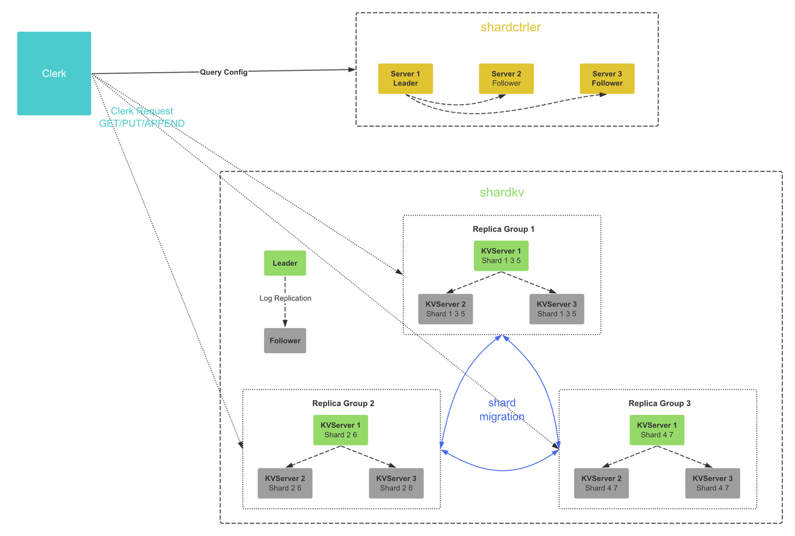
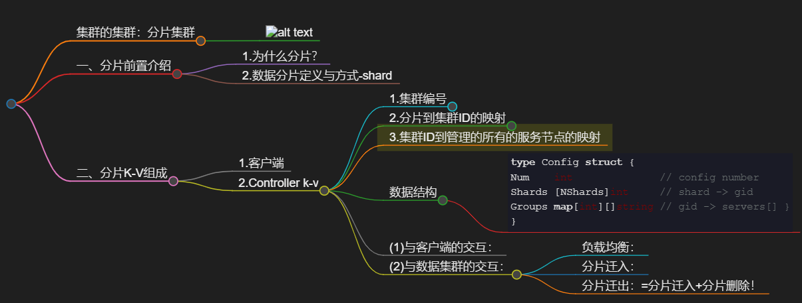

# 集群的集群：分片集群


# 一、分片前置介绍
## 1.为什么分片？

当一个数据集足够大时，高并发需要同步的的临界区就很大，分片可以减少临界区大小，从而提升IO水平！

## 2.数据分片定义与方式-shard
一个分片（shard）指的是一个 **Key/Value 数据集的一部分数据**，比如，对一个有很多数据的 KV 存储系统中，所有以 'a' 开头的 key 可以是一个分片，所有以 'b' 开头的 key 可以是一个分片，当然这里只是简单举一个 shard 划分的例子，实际上划分数据的办法还有很多，最常见的是 **Hash** 和 **Range**。


# 二、分片K-V组成
## 1.客户端

## 2.Controller k-v


说明：
总的是一个config数组，里面存放着每一个数据中心的配置信息，config的结构体的信息如下：
### 1.集群编号
### 2.分片到集群ID的映射
### 3.集群ID到管理的所有的服务节点的映射

----
### 数据结构
```go
type Config struct {​ 
Num    int              // config number​   
Shards [NShards]int     // shard -> gid​     
Groups map[int][]string // gid -> servers[]​ }
}
```

### (1)与客户端的交互：
这是控制中心，是客户端和数据中心集群的中介，每一次客户端的请求，都要在这获取访问数据集群的元配置信息，再往下访问相应的数据集群，比如：数据分片在那个集群。

### (2)与数据集群的交互：
配置中心负责数据集群的负载均衡、分片迁入迁出、分片删除等等工作

#### 负载均衡：
确保每一个数据集群的数据量都是差不多的，即负载均衡，这里采用了负载均衡理论——**均衡时，最大值和最小值相差不过1**。

#### 分片迁入：
现在客户端存储信息进来，配置中心集群会将其负载均衡到相应的集群上去，这时就是分片迁入

#### 分片迁出：=分片迁入+分片删除！
数据中心的某个集群A想将自己的数据迁移到另一个集群B里面去，也是需要配置中心来完成工作的！
即：将对应的数据迁移到B集群,在清除集群A对应分片！
