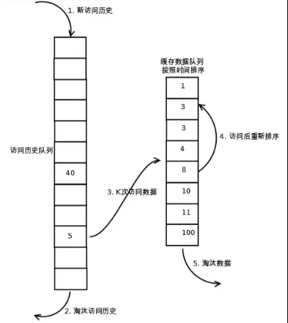
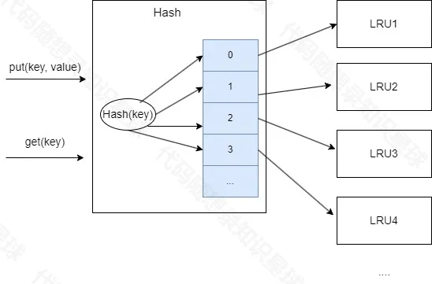

# 一、定义LRU——最近最久未使用

# 二、优点：
LRU的性能和效率接近`OPT`(最佳替换算法),但是对于频繁访问的页面更新开销较大。

## 拓展：OPT
最佳页面置换算法是一种理论上的页面置换算法，由操作系统科学家于 1966 年提出。该算法的核心思想是**在需要置换页面时**，选择**未来最长时间内不会被访问的页面进行淘汰**。

## 为什么LRU接近OPT？
本质：时间局部性原理
因为 LRU 算法基于 “**最近的过去可以预测最近的未来**” 这一假设，认为**最近最少使用的页面在未来也很可能不会被使用**，所以在很多情况下能做出接近 OPT 的置换决策。

# 三、缺点
## 淘汰热点数据
 如果加载一些不再会被访问的冷数据（如一次性数据），将原有的热点数据挤出，冷数据留在缓存中，降低了缓存的利用率。比如说一个数据前59分钟访问了1W次，后面1分钟没访问，就直接噶了！

## 对访问模式不敏感
 如果是循环的一次性遍历大量不重复的数据(如A->B->C->D->A->B->.…),LRU可能逐步清空，几乎无法命中。

## 不适用于某些场景
 在某些场景下，`最近最少使用并不代表最不重要或最少需要`。

## 锁的粒度大
 多线程高并发的访问下，`同步等待`将是一笔极大的时间开销。

# 四、优化——两次优化——热点K优化+哈希分片优化！

## 1.LRU-k
### 本质区别——数据热点化
  原来的`LRU算法访问一次`就放入缓存队列里面，现在需要`访问 k次`才放进缓存队列`(本质是数据热点化)`
  一般情况下，当k的值越大，缓存的命中率越高，但也使得缓存难以淘汰。综合来说，k = 2 时性能最优。
### 两队列
#### 历史访问队列
#### 缓存队列
 图解
  
### 缺点
  锁力度大，性能低，但是因为线程安全的需要，没办法一定需要锁，所以只能采用将LRU分片来进行优化缓存！~~

## 2.HashLRU
 图解
 
  优化本质：使用哈希优化方式`减小临界区的大小`，实现`高并发的等待时间的减少`！
### 分析
  与KLRUCache的关系
   `HashLruCaches和KLruCache类是组合关系`，前者依赖于后者，这是很明显的，因为HashLRU就是对KLRUCache进行分片包装而已！！当然包含了！
 注意
  LRU(LFU)分片之后淘汰的元素就不是全局中访问最近最不经常访问的元素了(全局的minFreq_)，淘汰的就是局部minFreq_

---
# 五、推荐好文：
  https://blog.csdn.net/saxon_li/article/details/123974696