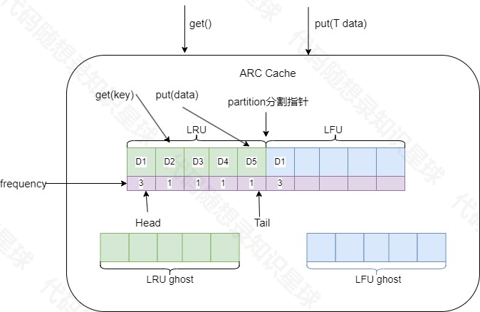

# 一、定义——自适应替换缓存算法
# 特点——三个队列，一个指针

## 核心思想：
动态调整LRU\LFU的容量~~**当访问的数据趋向于访问最近的内容，会更多地命中LRU list**，这样会增大LRU的空间；当**系统趋向于访问频繁访问的内容时，会更多地命中LFU list**，这样会增加LFU的空间。

## 应用场景
 主要应用于**不同的访问模式**(比如**近期频繁访问**和**周期性访问交叉**的场景)之间表现较好，因为他可以动态调整**缓存分区的大小**。

## linux的页面替换场景
    linux内核就是LRU缓存机制。这有时候会有严重的问题，如果你**需要读取大量的块却只需要用一次**，他还是会**不断的缓存到Cache中**。最后，**缓存中存在着没有意义的数据**，需要频繁读取的有用数据却因为这一次读取被交换回了磁盘交换区。ARC缓存将不会存在这样的问题，他会**自动的适应负荷**。（这就是他被称之为自适应预读缓存的原因）

# 二、特点
## 1.自适应性
 ARC动态调整两个缓存区域的大小：`T1(最近使用的元素)`和`T2(频繁访问的元素)`。它根据访问模式自动调整第略，适应不同的工作负载。
## 2.缓存分区
 将缓存分为两个部分：`LRU-like`区域：处理新进入的访问数据(最近最少使用，LRU), `LFU-like`区域：处理频繁访问的数据。
## 3.避免缓存污染
 ARC在不同的访问模式（如`频繁访问与一次性访问`）之间表现较好，因为它可以动态调整缓存分区的大小。
## 4.命中率高
 在混合访问模式下，ARC通常能够提供比单一策略更高的缓存命中率。

# 三、优点：
## 1.LRU的循环缓存问题
### 问题描述
 在LRU中，如果缓存中有热点数据（频繁访问的少量数据），但新的数据不断进入，可能导致热点数据被淘汰，出现**缓存抖动**(thrashing)
### ARC的解决方案
 ARC使用了**两个队列**来分别跟踪最近访问（类似LRU）和 经常访问 (类似LFU)的数据，并根据访问模式动态调整这两部分缓存的大小(马太效应，谁好就拓宽谁)，从而**避免热点数据**被过早淘汰。

## 2.解决了LFU的冷启动问题
### 问题描述
 在LFU中，新加入的缓存项`起初频率低`，可能在尚未证明**其重要性时就被淘汰**。
### ARC的解决方案
 ARC保留了个专门存储最近访问**但被淘汰的数据队列(ghost list)**，帮助**识别新数据的价值**(新数据就是这样被删除的!)。如果某个新数据被多次访问，可以 快速将 其提升为频繁访问的数据。

# 四、详细流程

## 1.查询缓存
 缓存穿透
  在缓存中查找客户端需要访问的数据，如果没有命中，表示缓存穿透，将需要访问的数据从从磁盘中取出，从LRU对应链表的尾部
 缓存命中
  如果命中且LFU链表中没有则判断该数据的访问次数是否大于transformTime_（自定义的变量，我这里设置为3，代表访问次数超过3次），`若大于则将该数据插入LFU对应链表中`（一个块至少需要读取transformTime_次，`并且要是最近请求的数据，才会被存储到LFU中`）。于是，该数据块不仅仅只保存在LRU的缓存目录中，也将保存到LFU中。`如果命中且LFU链表中存在，则将数据重新放入LFU链表中对应位置（访问频次计数+1）`，这样，那些真正被频繁访问的页面将一直呆在缓存中，不会被冷数据的加入而误淘汰，不经常访问的数据会向链表头部移动，最终被淘汰出去。就是借助LFU保存真正频繁访问的数据，借助LRU保存最近访问的数据~~两者都会有所涉及~~

## 2.LRU\LFU饱满
 如果此时LRU缓存满了，则从LRU链表中淘汰表头部的数据，将淘汰数据的key**放入LRU对应的ghost list**。然后在LRU的链表尾部添加新数据。如果ghost list的元素满了，按照先进先出的方式淘汰ghost list中的元素头部元素，然后再从尾部插入元素。

## Ghost List
LRU Ghost List
 `如未命中缓存的数据根据key发现在LRU对应的ghost list中，则表示幽灵命中`，缓存系统就可以知道，这是一个刚刚淘汰的页面，而不是第一次读取或者说很久之前读取的一个页面。于是根据这个信息`来调整内部的partition分割指针以适应当下的访问模式`。上述迹象说明`当前的LRU缓存太小了`，于是将partition分割指针右移一位（也就是LRU缓存空间+1，LFU缓存空间-1），并将命中的key数据从ghost的中移除，将新数据从LRU链表尾部插入。
LFU Ghost List
 反之如果未命中缓存的数据根据key发现在LFU对应的ghost中，则说明当前访问模式偏向于频繁访问经常被访问的那一些数据，说明当下LFU缓存空间太小了，对应partition分割指针左移一位，并将命中的key数据从ghost的中移除，将新数据从LRU链表尾部插入。

 # 五、总结
 ## 一个指针，三个队列
 本质是通过未命中缓存时，凭借查看对应的Ghost List中是否有相应数据达到**动态调整LRU和LFU的目的**！
 如果在ghost List中有，说明当前访问模式的容量过小了，增大对应的容量！(细节：缓存是有容量的！！)