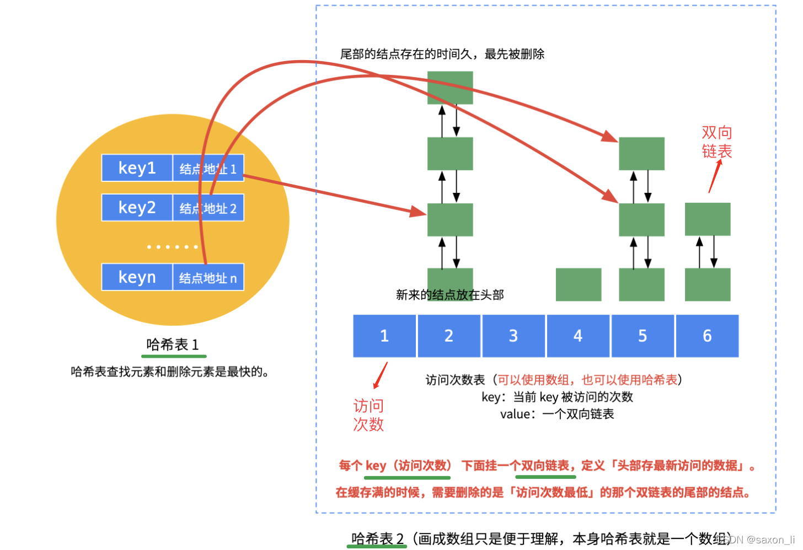

# 一、LFU定义——先按照频率，再按照时间
(所以本质上，是在LRU上面再套一层频率维度~)

# 二、定义——最不经常使用页面置换算法
# 三、理念
  马太效应(概率思想)：最近使用`频率高的数据很大概率将会再次被使用`,而最近`使用频率低的数据,将来大概率不会再使用`。

# 四、做法
  把`使用频率最小的数据置换出去`。这种算法更多是从`使用频率的角度`（但是当缓存满时，`如果最低访问频次的缓存数据有多个，就需要考虑哪个元素最近最久未被访问,化为LRU`）去考虑的。

# 五、实现
### 哈希表1：用于O(1)查找元素
### 哈希表2：用于O(1)查找频率LRU
### N个LRU链表：相同的频率的元素放在一个LRU链表里面，就会有无数个频率~

  LFU 仍需要结合`哈希表和双向链表`这两个结构进行操作，不过需要用`2 个哈希表再加上 N 个双链表`(**取决于频数个数<这里面就是LRU的实现>**)才能实现**先按照频数再按照时间**两个纬度的淘汰策略

---
 图示

 推荐好文：https://blog.csdn.net/saxon_li/article/details/123985667

# 六、优点

## 1.不会淘汰热数据
 解决了LRU算法的热数据淘汰问题！
 适应数据访问模式变化。就算`热数据消失一段时间，也是不会淘汰的`！

# 七、缺点

## 1.频率爆炸问题：
对于长期驻留在缓存中的热数据，频率计数可能会`无限增长`《开了无限个哈希频次链表》，占用额外的存储空间或导致计数溢出。

## 2.过时热点数据占用缓存：
一些数据可能已经不再是热点数据，但因`访问频率过高，难以被替换`（真是成也萧何，败也萧何）

## 3.冷启动问题：
刚加入缓存的项可能因为频率低而很快淘汰，即便这些项是近期访问的热门数据

## 4.不适合短期热点： 
LFU 对长期热点数据表现较好，但对短期热点数据响应较慢，可能导致短期热点数据无法及时缓存。

## 5.缺乏动态适应性：
固定的 LFU 策略难以适应不同的应用场景或工作负载。

## 6.锁粒度大，性能低：
锁的粒度大，多线程高并发访问下锁的同步等待时间过长。

# 八、优化：
## 优化一、降温处理
防溢出+冷热适中

### 做法
 在LFU算法之上，引入访问次数平均值概念，当平均值大于最大平均值限制时将所有结点的访问次数减去**最大平均值限制的一半或者一个固定值**。相当于**热点数据“老化”**了，这样可以避免**频次计数溢出**，也可以**缓解缓存污染**。

### 功能：
### 1.避免频次溢出
 如果一个数据项被频繁访问，其访问次数会不断累加，随着时间推移，可能会出现计数值溢出的情况
### 2.缓存缓存污染
 #### 热点数据
 热数据降温，给其他数据进入缓存的机会！
 #### 冷数据 
冷数据再降温，保护频次为1的数据
   实际上也是对刚加入的频次为1的数据的保护，因为一些数据冷可能在减值的情况下`已经达到1了(因为LRU的缘故！)`，这时就会优先淘汰冷数据，而不是刚加入的频次为1的数据

## 优化二 、hash分片

### 解决锁的粒度过大问题
方案
  将LFU分片实现之，将`每一个LFU分装在哈希数组里面`，然后使用哈希算法分片访问，可以`有效解决临界区过大`的问题，提高高并发性能
